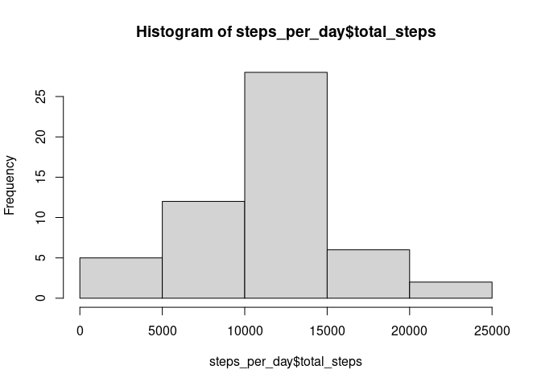
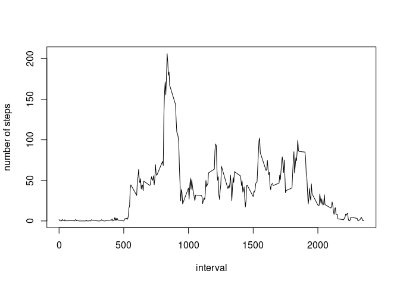
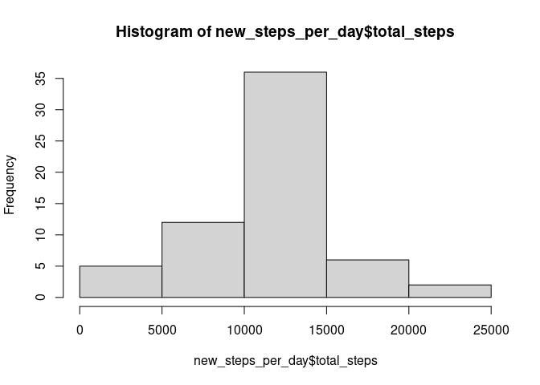
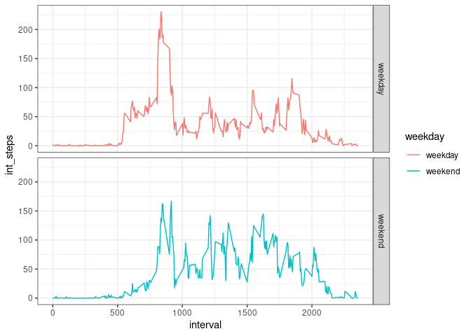

## Loading and preprocessing the data

``` r
suppressMessages(library(dplyr))
suppressMessages(library(tidyr))
suppressMessages(library(lubridate))
df <- read.csv("activity.csv")
```

## What is mean total number of steps taken per day?



    ## [1] 10766.19

## What is the average daily activity pattern?

1.  Make a time series plot (i.e.type = “l”) of the 5-minute interval
    (x-axis) and the average number of steps taken, averaged across all
    days (y-axis)

``` r
interval_5min <- df %>% 
  group_by(interval) %>% 
  summarize(int_steps=mean(steps, na.rm=TRUE))

plot(interval_5min$interval, interval_5min$int_steps, type="l", ylab="number of steps", xlab="interval")
```



1.  Which 5-minute interval, on average across all the days in the
    dataset, contains the maximum number of steps?

``` r
max_step <- max(interval_5min$int_steps)
max_5min <- interval_5min %>% 
  filter(int_steps == max_step)
max_5min
```

    ## # A tibble: 1 × 2
    ##   interval int_steps
    ##      <int>     <dbl>
    ## 1      835      206.

## Imputing missing values

1.  Calculate and report the total number of missing values in the
    dataset (i.e. the total number of rows with NA.

``` r
include_NA <- df %>% 
  filter(is.na(steps))
number_NA <- nrow(include_NA)
number_NA
```

    ## [1] 2304

1.  Devise a strategy for filling in all of the missing values in the
    dataset. The strategy does not need to be sophisticated. For
    example, you could use the mean/median for that day, or the mean for
    that 5-minute interval, etc.
2.  Create a new dataset that is equal to the original dataset but with
    the missing data filled in. “new_dataset” is the original dataset
    but with the missing data filled in.

``` r
# I use mean values of day to fill the missing value
mean_steps <- df %>% 
  group_by(interval) %>% 
  summarize(mean_steps=mean(steps, na.rm=TRUE))

df_add_mean <- left_join(df, mean_steps, by="interval")
new_dataset <- df_add_mean %>% 
  mutate(new_steps=ifelse(is.na(steps),mean_steps,steps)) %>% 
  select(new_steps, date, interval)
```

1.  Make a histogram of the total number of steps taken each day and
    Calculate and report the mean and median total number of steps taken
    per day.

``` r
new_steps_per_day <-  new_dataset%>% 
  group_by(date) %>% 
  summarize(total_steps=sum(new_steps))
hist(new_steps_per_day$total_steps)
```



``` r
new_mean_steps_per_day <- mean(new_steps_per_day$total_steps, na.rm=TRUE)
new_mean_steps_per_day
```

    ## [1] 10766.19

``` r
new_median_steps_per_day <- median(new_steps_per_day$total_steps, na.rm=TRUE)
new_median_steps_per_day
```

    ## [1] 10766.19

## Are there differences in activity patterns between weekdays and weekends?

1.  Create a new factor variable in the dataset with two levels –
    “weekday” and “weekend” indicating whether a given date is a weekday
    or weekend day.

``` r
new_dataset_weekday<- new_dataset %>% 
  mutate(weekday = wday(date)) %>% 
  mutate(weekday = ifelse(weekday %in% c(2,3,4,5,6),"weekday","weekend"))
```

1.  Make a panel plot containing a time series plot (i.e.type = “l”) of
    the 5-minute interval (x-axis) and the average number of steps
    taken, averaged across all weekday days or weekend days (y-axis).

Plot weekday data as red line, and weekend data as blue line.

``` r
interval_5min_weekday <- new_dataset_weekday %>% 
  group_by(weekday,interval) %>% 
  summarize(int_steps=mean(new_steps, na.rm=TRUE))
```

    ## `summarise()` has grouped output by 'weekday'. You can override using the `.groups` argument.

``` r
# abstruct weekday data. And plot.
weekday_data <- interval_5min_weekday %>% 
  filter(weekday == "weekday")
plot(weekday_data$interval, weekday_data$int_steps, type="l", ylab="number of steps", xlab="interval",col="red")
par(new=T)

#abstract weekend data. And plot.
weekend_data <- interval_5min_weekday %>% 
  filter(weekday == "weekend")
plot(weekend_data$interval, weekend_data$int_steps, type="l", ylab="number of steps", xlab="interval", col="blue")
```



Note that the `echo = FALSE` parameter was added to the code chunk to
prevent printing of the R code that generated the plot.
