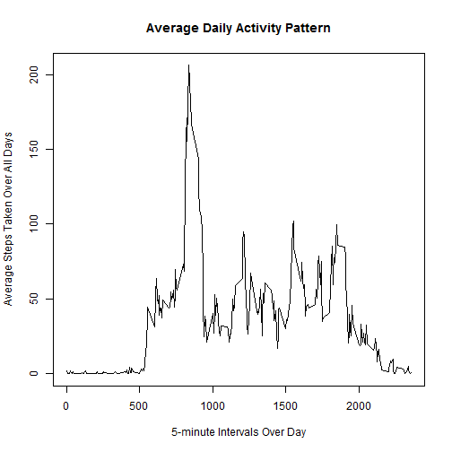

# Reproducible Research - Assignment 1

## Loading and preprocessing the data


```r
## unzip the data set
unzip("activity.zip")

# read the data
activitydata <- read.csv("activity.csv")
```


## What is mean total number of steps taken per day?

**1.Make a histogram of the total number of steps taken each day**


```r
NumOfStepsPerDay <- aggregate(steps ~ date, data = activitydata, FUN = sum)

hist(NumOfStepsPerDay$steps, breaks = nrow(NumOfStepsPerDay), main = "Total Number of Steps Per Day", 
    xlab = "Steps Per Day", col = "blue")
```

 


**2.Calculate and report the mean and median total number of steps taken per day**


```r
meanNumOfStepsPerDay <- mean(NumOfStepsPerDay$steps)
medianNumOfStepsPerDay <- median(NumOfStepsPerDay$steps)
```


The mean and the median total numbers of steps taken per day are **1.0766 &times; 10<sup>4</sup>** and **10765**

## What is the average daily activity pattern?


```r
AvgPerInterval <- aggregate(steps ~ interval, data = activitydata, FUN = mean)
```


**1 Make a time series plot of the 5-minute interval and the average number of steps taken, averaged across all days**


```r
plot(AvgPerInterval, type = "l", main = "Average Daily Activity Pattern", xlab = "5-minute Intervals Over Day", 
    ylab = "Average Steps Taken Over All Days")
```

 

```r

max.interval <- AvgPerInterval[which.max(AvgPerInterval$steps), "interval"]
```


**2.Which 5-minute interval, on average across all the days in the dataset, contains the maximum number of steps?**

The 5-minute interval, on average across all days, that contains the maximum number of steps is **835**

### Imputing missing values

**Calculate the total number of missing values in the dataset**

```r
total.missing <- sum(is.na(activitydata))
```


The total number of mising values is 2304

**2.Devise a strategy for filling in all of the missing values in the dataset. The strategy does not need to be sophisticated. For example, you could use the mean/median for that day, or the mean for that 5-minute interval, etc.**

The missing values will be imputed by replacing step NAs with the **Mean** of the 5-minute interval averaged across all days.


```r
# create a vector of steps with NAs replaced by imputed value (mean of
# 5-minute interval)
impusteps <- numeric()
for (i in 1:nrow(activitydata)) {
    obs <- activitydata[i, ]
    if (is.na(obs$steps)) {
        steps <- subset(AvgPerInterval, interval == obs$interval)$steps
    } else {
        steps <- obs$steps
    }
    impusteps <- c(impusteps, steps)
}
```

**3. create a new dataset that is equal to the original dataset but with the missing data filled in.**


```r
impudata <- activitydata
impudata$steps <- impusteps

# find the total number of steps taken each day
impuStepsPerDay <- aggregate(steps ~ date, data = impudata, FUN = sum)
```


**4. Make a histogram of the total number of steps taken each day and Calculate and report the mean and median total number of steps taken per day. Do these values differ from the estimates from the first part of the assignment? What is the impact of imputing missing data on the estimates of the total daily number of steps?**


```r
hist(impuStepsPerDay$steps, breaks = nrow(impuStepsPerDay), main = "Total Number of Steps Per Day With Imputed Values", 
    xlab = "Steps Per Day", col = "green")
```

 

```r

# Calculate the mean and median total number of steps taken per day
impuMeanStepsPerDay <- mean(impuStepsPerDay$steps)
impuMedianStepsPerDay <- median(impuStepsPerDay$steps)
```


The imputed mean total number of steps taken per day is **1.0766 &times; 10<sup>4</sup>**
The imputed median total number of steps taken per day is **1.0766 &times; 10<sup>4</sup>**

We can observer that by imputing the missing step values, the mean total number of steps per day remained unchanged while the median total number of steps per day changed from **10765** to **1.0766 &times; 10<sup>4</sup>**. The impact of the imputation was a very thin increase in the median total number of steps per day.

## Are there differences in activity patterns between weekdays and weekends?

**1. Create a new factor variable in the dataset with two levels "weekday" and weekend" indicating whether date is a weekday or weekend day.**


```r
## change date column from factor to Date

impudata$date <- as.Date(impudata$date)

weekend.days <- c("Saturday", "Sunday")
impudata$daytype <- as.factor(sapply(impudata$date, function(x) ifelse(weekdays(x) %in% 
    weekend.days, "weekend", "weekday")))
```


**2. Make a panel plot containing a time series plot (i.e. type = 'l') of the 5-minute interval (x-axis) and the average number of steps taken, averaged across all weekday days or weekend days (y-axis).**


```r
require(plyr)
```

```
## Loading required package: plyr
```

```
## Warning: package 'plyr' was built under R version 3.0.3
```

```r
## Loading required package: plyr
avgsteps <- ddply(impudata, .(interval, daytype), summarize, steps = mean(steps))

require(lattice)
```

```
## Loading required package: lattice
```

```
## Warning: package 'lattice' was built under R version 3.0.3
```

```r
## Loading required package: lattice
xyplot(steps ~ interval | daytype, data = avgsteps, layout = c(1, 2), type = "l", 
    xlab = "5-minute Intervals Over Day", ylab = "Number of Steps", main = "Activity Patterns on Weekends and Weekdays")
```

 
